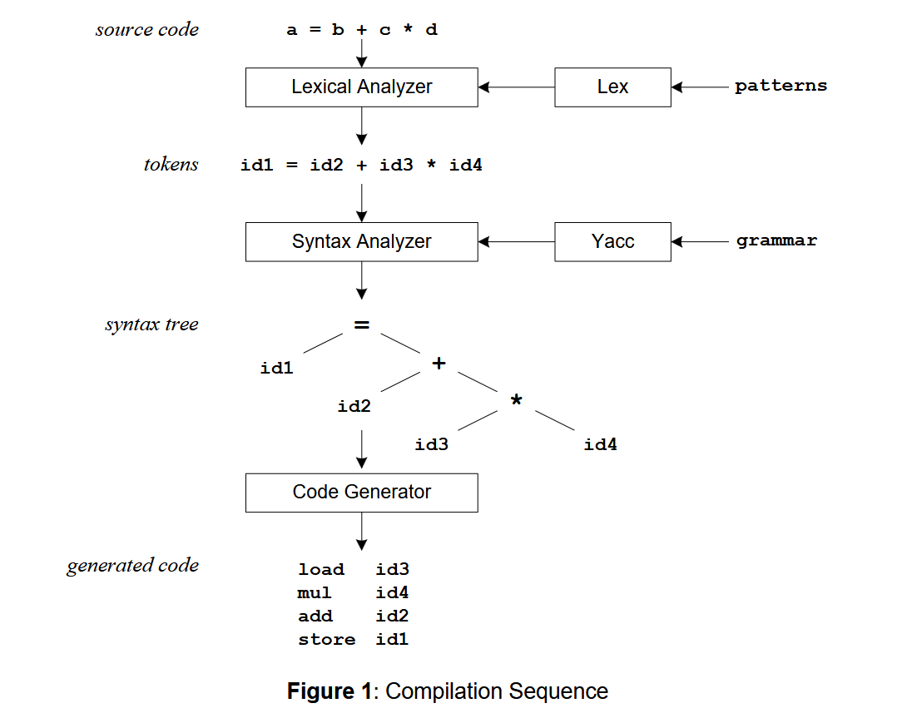
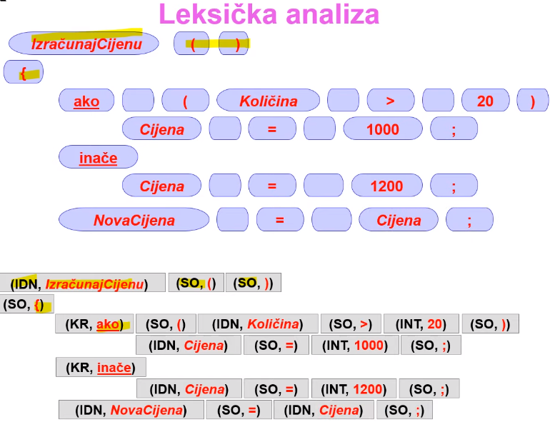
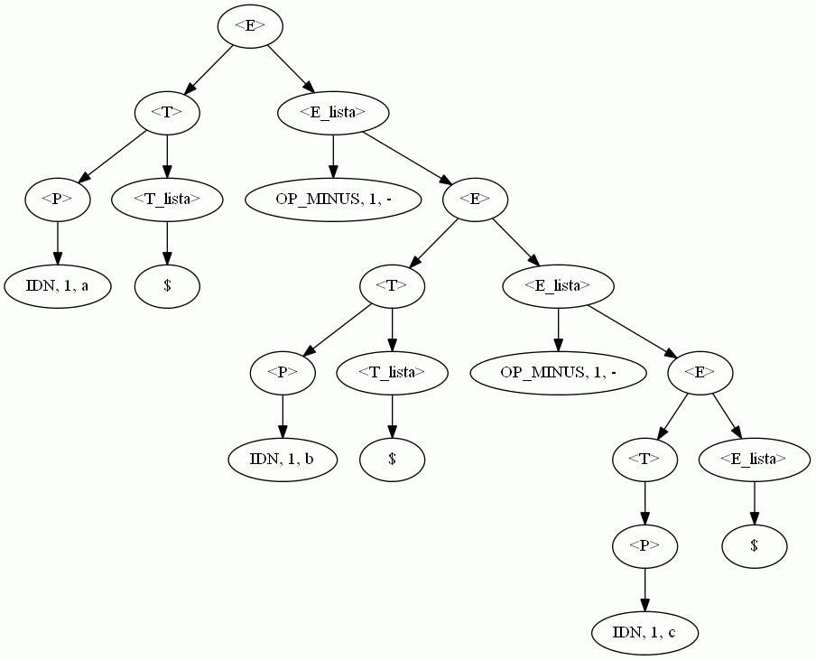
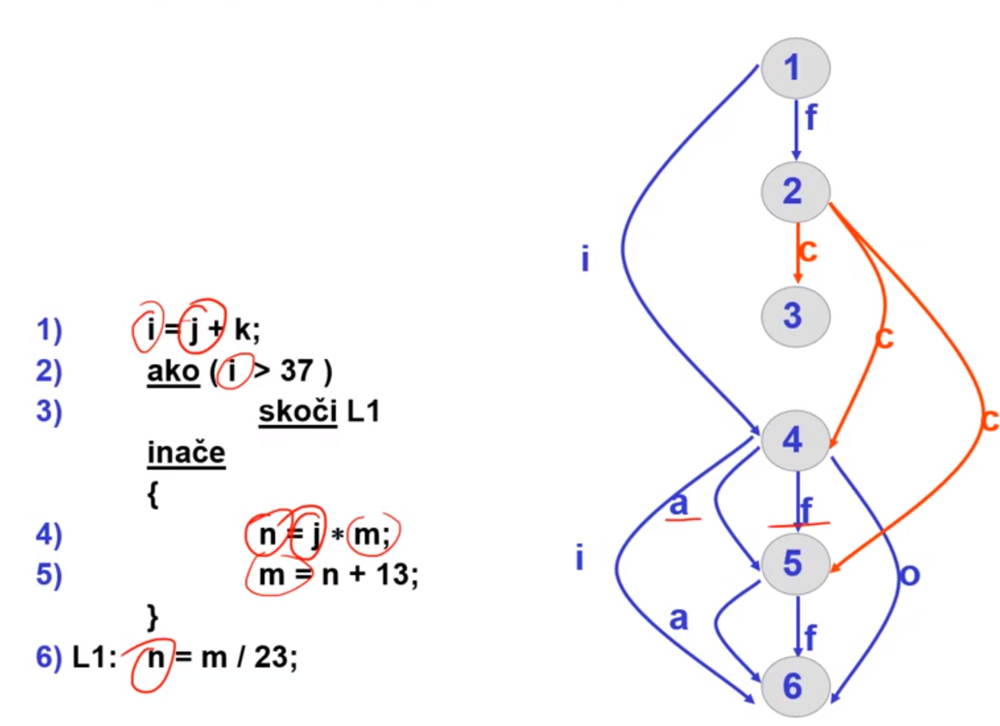
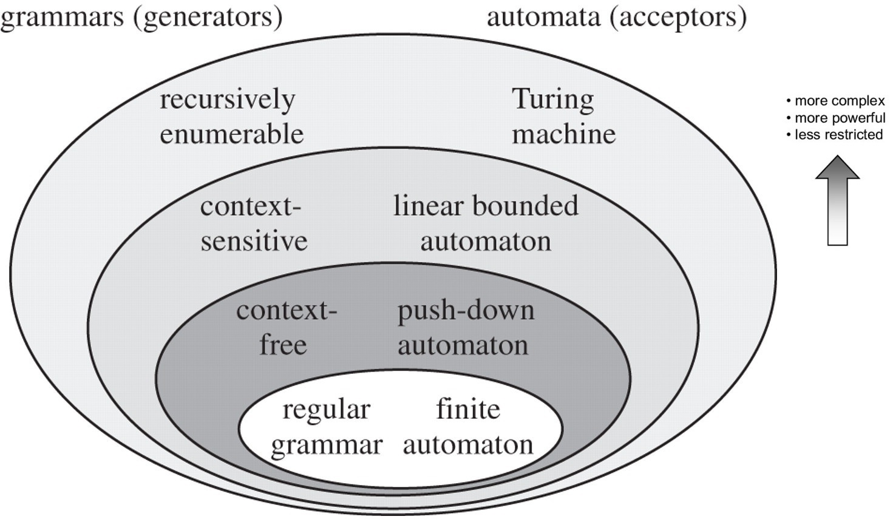
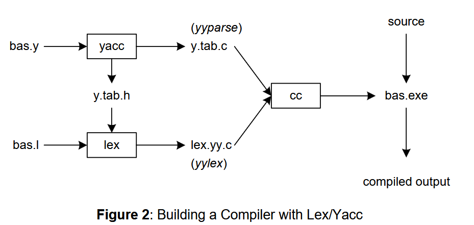

# Lexsyn Compiler



This repository implements a complete educational compiler pipeline for the PJ programming language, developed through four laboratory assignments in the Compiler Construction course at FER, University of Zagreb. The project progresses through the classic phases of compilation:

- lexical analysis
- syntax analysis
- semantic analysis
- code generation

Each phase consumes the output of the previous phase and produces a richer internal representation until a runnable FRISC (academic CPU core description, you can find a simulator [here](https://github.com/izuzak/FRISCjs)) assembly program is generated

- 32-bit integers, 256 KB memory
- `R7` is SP
- global variable `rez` contains the final result, loaded into `R6` before halting
- Execution terminates with `HALT`

The compiler is implemented as a pipeline:

```
PJ Source Code
│      
▼
Lexical Analysis  -> Token stream
                        │
                        ▼
                        Syntax Analysis   -> Parse tree
                                                │    │
                                                ▼    ▼
                                                │   Semantic Analysis -> Annotated&validated Tree
                                                │    │
                                                ▼    ▼
                                                Code Generation   -> FRISC assembly
```

## PJ language

PJ is a small imperative language. It contains enough features to demonstrate all fundamental compilation stages:

- Integer arithmetic
     - Unary `+` and `-`
     - Binary `+`, `-`, `*`, `/`
     - Parentheses
- Variables
     - automatic definition on first assignment
     - assignment statements
     - lexical scoping
- Nested `for` loops (`za ... od ... do ... az`)
- Arithmetic expressions with precedence
- Comments

Example:

```
n = 10    // loop counter
rez = 0   // result

za i od 1 do n
    rez = rez + i*i*i
az
```

## Stage 1: Lexical Analysis



At this stage the raw source code into a stream of tokens. It recognizes language elements while discarding whitespace and comments. A few examples of tokens are:

| Token       | Meaning          |
| ----------- | ---------------- |
| IDN         | identifier       |
| BROJ        | integer constant |
| OP_PRIDRUZI | =                |
| OP_PLUS     | +                |
| L_ZAGRADA   | (                |
| KR_ZA       | keyword 'for'    |

And these will be emitted in the `TOKEN_TYPE LINE_NUMBER CHAR`

For example `n = 10` becomes:

```
IDN 2 n
OP_PRIDRUZI 2 =
BROJ 2 10
```

The implementation uses a **Deterministic Finite Automata (DFA)**, where each token class is represented as a small DFA.

## Stage 2: Syntax Analysis

The parser receives the token stream and verifies that it follows the grammar of PJ. If successful, it constructs a parse tree:



The language is specified using an LL(1) grammar ([Backus–Naur form](https://en.wikipedia.org/wiki/Backus%E2%80%93Naur_form)). Here are the productions:

```
<program> ::= <lista_naredbi>
<lista_naredbi> ::= <naredba> <lista_naredbi>
<lista_naredbi> ::= $
<naredba> ::= <naredba_pridruzivanja>
<naredba> ::= <za_petlja>
<naredba_pridruzivanja> ::= IDN OP_PRIDRUZI <E>
<za_petlja> ::= KR_ZA IDN KR_OD <E> KR_DO <E> <lista_naredbi> KR_AZ
<E> ::= <T> <E_lista>
<E_lista> ::= OP_PLUS <E>
<E_lista> ::= OP_MINUS <E>
<E_lista> ::= $
<T> ::= <P> <T_lista>
<T_lista> ::= OP_PUTA <T>
<T_lista> ::= OP_DIJELI <T>
<T_lista> ::= $
<P> ::= OP_PLUS <P>
<P> ::= OP_MINUS <P>
<P> ::= L_ZAGRADA <E> D_ZAGRADA
<P> ::= IDN
<P> ::= BROJ
```

where the major syntactic constructs are:

```
program
└── list of statements
statement
├── assignment
└── for-loop
expression
├── addition/subtraction
├── multiplication/division
├── unary operators
└── parentheses
```

The grammar explicitly encodes operator precedence:

1. Parentheses and unary operators
2. Multiplication and division
3. Addition and subtraction

Here, the table-driven predictive parsing was done using a **Pushdown Automata (PA)**.

### Error Detection

The parser supports input error detection. It will not attempt any automatic recovery, rather just reports the first syntax error encountered. For example:

```
err BROJ 2 0     // '0' used as a range bound: 'za i od 1 do 0'
err kraj         // EOF reached unexpectedly
```

## Stage 3: Semantic Analysis



Identifier visibility, scope, and lifetime rules are verified here, using the stage 2 parse tree as the input.

- PJ uses static (lexical) scoping: loop-introduced nested variables have their own block scope.
  
     - stack is used while building symbol table, where scopes are pushed on the stack when entering a loop, and popped when leaving the loop

- Every variable must be defined before it is used. Using an undefined variable produces a semantic error

For every identifier usage, the analyzer prints `usage_line definition_line lexical_unit`:

```
3 1 n    // n used on line 3 was defined on line 1
4 2 rez  // rez used on line 4 was defined on line 2
```

## Stage 4: Code Generation

The final phase translates the semantically valid PJ program into FRISC assembly language. The inputs are the parse tree from stage 2 and semantic information from stage 3 (to resolve variable references).


### Variables

In interest of simplicity, full logic of mapping variables to CPU registers was not done. Rather

- fixed addresses were used for global (static) variables

- the stack was used for local-scope (automatic) variables.
  
     - scope information from semantic analysis is required for code geneartion

```
V0 DW 0
V1 DW 0
V2 DW 0
```

### Expressions

Expressions are evaluated using the stack, as the operands and operations are pushed as encountered. When pushing an operations, previous operands are popped off to registers, the operation is carried out, and the result is pushed back on. This is definitely the most instruction-efficient approach, but functions well for it's simplicity.

For example:

```
# input
x = 3
rez = x - 2
```

```
# generated instructions
; stack init
MOVE 40000, R7

; 3
MOVE %D 3, R0
PUSH R0

; x = 3
POP R0
STORE R0, (V0)

; x
LOAD R0, (V0)
PUSH R0

; 2
MOVE %D 2, R0
PUSH R0

; x - 2
POP R1
POP R0
SUB R0, R1, R2
PUSH R2

; rez = x - 2
POP R0
STORE R0, (V1)

; "return" rez
LOAD R6, (V1)
HALT

; variables
V0 DW 0 ; x
V1 DW 0 ; rez
```

For more complex operations not supported by FRISC, subprograms are used, found in `subprograms`. For example:

```
MUL     CALL MD_INIT
        XOR R1, 0, R1
        JP_Z MUL_RET ; op2 == 0
        SUB R1, 1, R1
MUL_1   ADD R2, R0, R2
        SUB R1, 1, R1
        JP_NN MUL_1 ; >= 0?
MUL_RET CALL MD_RET
        RE
```

### Loops

For loops, the counter initial value is calculated, then a label is assigned to the first loop instruction, and after the last loop instruction the logic for counter decrement and compare is added

```
# input
x = 3
y = 5
rez = 0
za x od 1 do y
 rez = rez + x
az
```

Loop preparation

```
MOVE 40000, R7 ; init stog

; 3
MOVE %D 3, R0
PUSH R0

; x = 3
POP R0
STORE R0, (V0)

; 5
MOVE %D 5, R0
PUSH R0

; y = 5
POP R0
STORE R0, (V1)

; 0
MOVE %D 0, R0
PUSH R0

; rez = 0
POP R0
STORE R0, (V2)

; initializing counter with x with 1
MOVE %D 1, R0
PUSH R0
POP R0
STORE R0, (V3)
```

Loop code

```
; labeled loop start
L0

; rez
LOAD R0, (V2)
PUSH R0

; x
LOAD R0, (V3)
PUSH R0

; rez + x
POP R1
POP R0
ADD R0, R1, R2
PUSH R2

; rez = rez + x
POP R0
STORE R0, (V2)

; increment x
LOAD R0, (V3)
ADD R0, 1, R0
STORE R0, (V3)

; y
LOAD R0, (V1)
PUSH R0

; x do y
LOAD R0, (V3)
POP R1
CMP R0, R1
JP_SLE L0

; rez
LOAD R0, (V2)
PUSH R0; rez

; x
LOAD R0, (V0)
PUSH R0

; rez + x
POP R1
POP R0
```

Return

```
; "return" rez
LOAD R6, (V2)
HALT

; variables
V0 DW 0 ; x
V1 DW 0 ; y
V2 DW 0 ; rez
V3 DW 0 ; x L0
```

## Automata details



Input file example for a PDA which accepts the "{w2w<sup>R</sup> | w(0+1)*}" language:

```
0|0,2,0|1,2,0    # comma-separated input sequences
q1,q2,q3         # states
0,1,2            # input characters
J,N,K            # stack characters
q3               # acceptable states
q1               # starting state
K                # stack input character
q1,0,K->q1,NK    # transition functions, (currentState, inputCharacter, stackCharacter)...
q1,1,K->q1,JK
q1,0,N->q1,NN
q1,1,N->q1,JN
q1,0,J->q1,NJ
q1,1,J->q1,JJ
q1,2,K->q2,K
q1,2,N->q2,N
q1,2,J->q2,J
q2,0,N->q2,$
q2,1,J->q2,$
q2,$,K->q3,$
```

Output example

```
q1#K|q1#NK|0
q1#K|q1#NK|q2#NK|q2#K|q3#$|1
q1#K|q1#JK|q2#JK|fail|0
```

To run the simulators, simply pipe in an example and specify an output file. Then you can use FC to verify the produced output againts the expected one:

```
python py.py < ./tests/test01/primjer.in > izlaz.out
FC izlaz.out ./tests/test01/primjer.out
```

## Tools for lexer and parser generation

The lexer, parser, analyzer and generator were written manually here, in interest of learning. However, for serious applications where a custom language needs to be processed, there exist ready-made tools which can do so automatically, even under the GNU license.

The main examples here are:

- `flex` - takes a regex for each token in the language, and produces a lexer

- `bison`/`yacc` - take a BNF grammar, and produce a parser



```
# bas.l - all pattern matching rules for lex  ()
# bas.y - grammar rules for yacc

# Commands to create our compiler bas.exe
yacc –d bas.y                 # create y.tab.h, y.tab.c
lex bas.l                     # create lex.yy.c
cc lex.yy.c y.tab.c –obas.exe # compile/link
```
